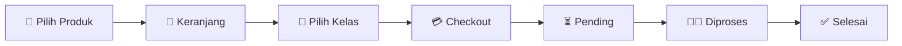

<div align="center">

# 🍱 ALFAGO

### Marketplace & layanan pesan-antar internal sekolah

Pesan makanan dan minuman dari toko atau PKL sekitar sekolah,<br>
lalu antarkan langsung ke kelas dengan proses yang cepat dan terorganisir.

[](https://laravel.com)
[](https://livewire.laravel.com)
[](https://tailwindcss.com)
[](https://www.mysql.com)

</div>

---

## 📖 Tentang ALFAGO

**ALFAGO** adalah aplikasi marketplace internal sekolah yang mempertemukan siswa dengan toko sekolah dan pedagang kaki lima (PKL). Siswa dapat mencari produk, memasukkannya ke keranjang, memilih kelas tujuan, lalu membuat pesanan menggunakan metode pembayaran tunai atau QRIS.

Di sisi pengelola, tersedia panel admin untuk mengatur seluruh data master, memproses pesanan, memantau performa penjualan, dan membuat teks konfirmasi WhatsApp yang sudah dikelompokkan berdasarkan vendor.

## ✨ Fitur Utama

### Untuk pengguna

- 🔎 Katalog publik dengan pencarian secara real-time
- 🗂️ Filter produk berdasarkan kategori
- 🏪 Informasi produk, harga, stok, dan vendor
- 🛒 Keranjang belanja interaktif menggunakan Livewire
- 📍 Pemilihan kelas sebagai lokasi pengantaran
- 💵 Dukungan pembayaran **Cash** dan **QRIS**
- 📝 Catatan tambahan pada saat checkout
- 🧾 Riwayat dan detail pesanan
- 📦 Pemantauan status pesanan

### Untuk admin

- 📊 Dashboard analitik penjualan 30 hari
- 📈 Statistik omzet, produk terlaris, kelas teratas, vendor, dan pembayaran
- 🧑‍🍳 Pengelolaan vendor toko maupun PKL
- 🍜 Pengelolaan produk, kategori, kelas, dan banner
- 🚚 Pengaturan biaya pengantaran
- 🔄 Pemrosesan status pesanan secara bertahap
- 💬 Pembuatan teks WhatsApp otomatis untuk setiap vendor
- 🔗 Link grup WhatsApp yang dapat diatur dari data vendor
- 🔐 Pembatasan halaman berdasarkan peran admin dan pengguna

## 🔄 Alur Pesanan



Saat pesanan dikonfirmasi, ALFAGO membuat teks pesanan terpisah untuk masing-masing vendor. Admin dapat menyalin teks tersebut dan langsung membuka grup WhatsApp vendor terkait.

## 🧰 Teknologi

| Bagian | Teknologi |
|---|---|
| Backend | PHP 8.3+, Laravel 13 |
| Antarmuka interaktif | Livewire 4, Alpine.js |
| Styling | Tailwind CSS 4 |
| Grafik | Chart.js 4 |
| Database | MySQL 8 |
| Asset bundler | Vite 8 |
| Web server | Nginx |
| Lingkungan pengembangan | Docker Compose |
| Pengujian | PHPUnit 12 |

## 🚀 Menjalankan Aplikasi

### Prasyarat

Pastikan perangkat sudah memiliki:

- Docker dan Docker Compose
- Node.js dan npm
- Image PHP lokal yang ditentukan di `.env.compose`, secara bawaan `local/laravel-php:8.4`

### Instalasi dengan Docker

File ini berada di dalam folder `src`. Jalankan perintah berikut dari **root project**, yaitu direktori yang berisi `docker-compose.yml`:

```bash
# 1. Jalankan container
docker compose --env-file .env.compose up -d

# 2. Pasang dependency PHP
docker compose --env-file .env.compose exec app composer install

# 3. Pasang dan build asset frontend
cd src
npm install
npm run build
cd ..

# 4. Siapkan aplikasi dan database
docker compose --env-file .env.compose exec app php artisan key:generate
docker compose --env-file .env.compose exec app php artisan migrate:fresh --seed
docker compose --env-file .env.compose exec app php artisan storage:link
```

> [!WARNING]
> Perintah `migrate:fresh --seed` akan menghapus seluruh tabel dan mengisinya kembali dengan data demo. Gunakan hanya untuk instalasi baru atau lingkungan pengembangan.

Setelah proses selesai, layanan dapat diakses melalui:

| Layanan | Alamat |
|---|---|
| Aplikasi ALFAGO | [http://localhost:8080](http://localhost:8080) |
| Panel Admin | [http://localhost:8080/admin/dashboard](http://localhost:8080/admin/dashboard) |
| phpMyAdmin | [http://localhost:8081](http://localhost:8081) |
| MySQL | `localhost:33060` |

## 🔑 Akun Demo

Seeder menyediakan akun berikut:

| Peran | Email | Password |
|---|---|---|
| Admin | `admin@alfago.test` | `password` |
| Pengguna | `user@alfago.test` | `password` |

Data akun admin dapat disesuaikan melalui variabel berikut pada file `.env` sebelum menjalankan seeder:

```env
ADMIN_NAME="Admin ALFAGO"
ADMIN_EMAIL=admin@alfago.test
ADMIN_PASSWORD=password
```

> [!IMPORTANT]
> Ganti kredensial bawaan sebelum aplikasi digunakan di lingkungan produksi.

## 🧪 Pengujian

Jalankan test suite dari root project:

```bash
docker compose --env-file .env.compose exec app php artisan test
```

Periksa juga proses build frontend:

```bash
cd src
npm run build
```

Pengujian mencakup katalog publik, autentikasi, otorisasi admin, checkout, pengurangan stok, snapshot nilai pesanan, perubahan status, dan pengelompokan teks WhatsApp.

## 🗂️ Struktur Direktori

```text
src/
├── app/
│   ├── Enums/          # Status, peran, dan metode pembayaran
│   ├── Http/           # Controller dan middleware
│   ├── Livewire/       # Komponen halaman pengguna dan admin
│   ├── Models/         # Model Eloquent
│   └── Services/       # Logika keranjang dan checkout
├── database/
│   ├── migrations/     # Struktur tabel
│   └── seeders/        # Data awal dan akun demo
├── resources/
│   ├── css/            # Styling aplikasi
│   ├── js/             # JavaScript dan grafik
│   └── views/          # Blade dan tampilan Livewire
├── routes/             # Rute web aplikasi
└── tests/              # Pengujian otomatis
```

## ⚙️ Konfigurasi Penting

- **Biaya pengantaran** dapat diubah melalui menu **Admin → Ongkir**.
- **Link grup WhatsApp** dapat diubah melalui menu **Admin → Vendor → Edit**.
- **Stok kosong** pada data produk berarti stok tidak dibatasi.
- Nilai harga, nama produk, dan ongkir disimpan sebagai snapshot ketika checkout sehingga riwayat pesanan tetap konsisten.

## 🤝 Kontribusi

Kontribusi dapat dilakukan dengan membuat branch baru, mengembangkan perubahan, menjalankan pengujian, lalu mengajukan pull request.

```bash
git checkout -b feature/nama-fitur
```

Pastikan perubahan tetap mengikuti gaya penulisan Laravel dan tidak merusak alur checkout maupun pengelolaan stok.

---

<div align="center">

Dibuat untuk membantu proses jual-beli di lingkungan sekolah menjadi lebih mudah, cepat, dan transparan. ❤️

**ALFAGO — Jajan favorit, diantar ke kelas.**

</div>
